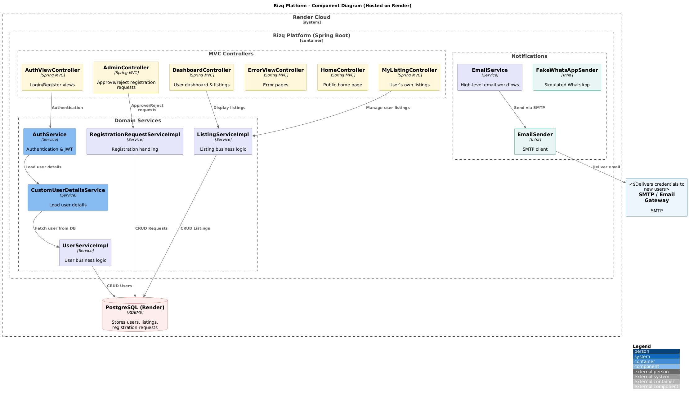
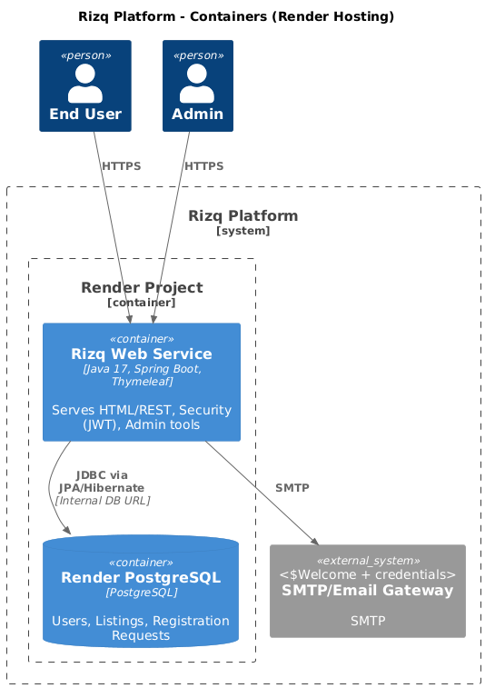

# 🌟 Rizq Platform

**Rizq Platform** a platform designed to support local work and daily services.  
It allows users to register, browse, and publish service/job listings within their city, with a simple and user-friendly interface.

## 🧩 Component Diagram

This diagram illustrates the internal structure of the **Rizq Platform** application, showing the main components, their responsibilities, and interactions.



---

## 🚀 Live Demo
**Hosted on Render:** [https://rizq-platform.onrender.com](https://rizq-platform.onrender.com)  

---
## 📖 How to Use
1. **Register an Account**
  - Go to the **Registration** page and fill in your details (Full Name, Phone Number, Service Type, City, Email).
  - Your registration request will be sent to the Admin for review.

2. **Admin Approval**
  - Once approved, you will receive an **Email** containing:
    - Your **Username**
    - Your **Password**
  - The email also includes a short welcome message.

3. **Login**
  - Use the provided username and password to log in.
  - After logging in, you can create, edit, and delete your own service/job listings.

4. **Explore Listings(services)**
  - Search by city or service type.
  - View other users’ listings but you can only edit/delete your own.

5. **Security**
  - Authentication is handled via **JWT Tokens**.
  - Users with `ADMIN` role can access the Admin Dashboard to approve/reject registration requests.
   ---
   ## 📦 Container Diagram



## 📌 Features
- **User Registration & Login** (with role-based access: `ADMIN` and `USER`)
- **Service & Job Listings**
  - Add, edit, delete services
  - View latest services in your city
  - Search and filter by city & service type
- **Registration Requests Management** (by Admin)
- **Secure Authentication** using JWT
- **Responsive UI** with Thymeleaf templates
- **PostgreSQL database** hosted on Render

---

## 🛠 Tech Stack
- **Backend:** Java 17+, Spring Boot 3
- **Frontend:** Thymeleaf, HTML, CSS, Bootstrap
- **Database:** PostgreSQL (Render)
- **Authentication:** Spring Security + JWT
- **Build Tool:** Maven
- **Deployment:** Render
- **CI/CD**: GitHub Actions

---

## ⚙️ Local Development Setup

### 1️⃣ Clone the repository
```bash
git clone https://github.com/ahmadkadri978/rizq-platform.git
cd rizq-platform
```

### 2️⃣ Create a local database (H2)
 
Use  `src/main/resources/application-h2.properties`:
```properties
spring.datasource.url=jdbc:h2:mem:rezqdb;DB_CLOSE_DELAY=-1;DB_CLOSE_ON_EXIT=FALSE
spring.datasource.driver-class-name=org.h2.Driver
spring.datasource.username=sa
spring.datasource.password=

spring.jpa.database-platform=org.hibernate.dialect.H2Dialect
spring.jpa.hibernate.ddl-auto=create-drop

# H2 Console 
spring.h2.console.enabled=true
spring.h2.console.path=/h2-console
```

---

### 3️⃣ Build & Run locally
```bash
mvn clean package
java -jar target/*.jar
```

---

📧 **Email** :`ahmadkadri@web.de`  
🔗 **Portfolio**: [https://ahmadkadri978.github.io/portfolio](https://ahmadkadri978.github.io/portfolio)
